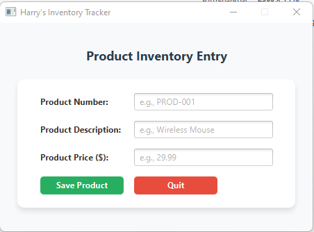
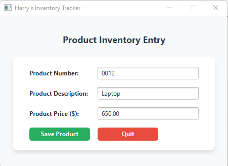
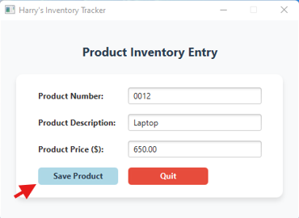
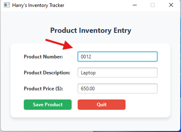
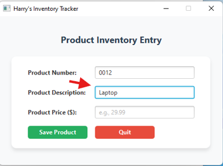
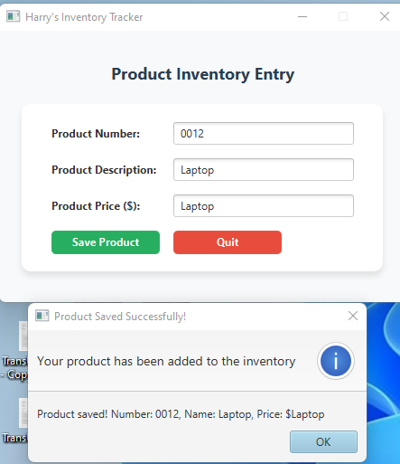
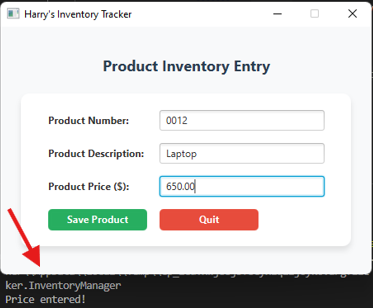

# Lab6 Inventory Manager GUI

## Project Metadata
- Author: Harry Joseph
- Created: 2025-10-16
- Platform: JavaFX (Java 21 LTS + Maven)
- Package Manager: Maven
- Java Version: 21 LTS
- UI Framework: JavaFX 21

## Overview
Lab6 Inventory Manager GUI demonstrates a modern JavaFX desktop application for inventory management. The project showcases event-driven programming with explicit EventHandler classes, programmatic UI creation without FXML, and automated testing with screenshot capture.

## Quick Download

**Get the complete project instantly:**

[](https://github.com/hjoseph777/inventory-manager-app/releases/download/v1/inventory-manager-app.zip)

*Complete JavaFX project with automated testing ready to run*

## Important: Where your key code lives
- The main application is in [`src/main/java/com/inventorytracker/InventoryManager.java`](src/main/java/com/inventorytracker/InventoryManager.java) with event handlers and UI creation
- The automated test suite is in [`src/main/java/com/inventorytracker/InventoryManagerTest.java`](src/main/java/com/inventorytracker/InventoryManagerTest.java) with screenshot capture
- The Maven configuration is in [`pom.xml`](pom.xml) with JavaFX and testing dependencies

## Project Explorer
An interactive, collapsible view of the codebase. Click file names to open them.

<details open>
   <summary><strong>src/main/java/ – Core Application</strong></summary>

   - 📁 <strong>src/main/java</strong>
      - 📄 [`module-info.java`](src/main/java/module-info.java) – Java module configuration
      - 📁 <strong>com/inventorytracker</strong>
         - 🏠 [`InventoryManager.java`](src/main/java/com/inventorytracker/InventoryManager.java) – **Main application with event handlers**
         - 🧪 [`InventoryManagerTest.java`](src/main/java/com/inventorytracker/InventoryManagerTest.java) – **Automated test suite with screenshots**
</details>

<details>
   <summary><strong>src/main/resources/ – UI Resources</strong></summary>

   - 📁 <strong>src/main/resources</strong>
      - 📁 <strong>com/inventorytracker</strong>
         - 🎨 [`primary.fxml`](src/main/resources/com/inventorytracker/primary.fxml) – Primary UI layout (reference)
         - 🎨 [`secondary.fxml`](src/main/resources/com/inventorytracker/secondary.fxml) – Secondary UI layout (reference)
</details>

<details>
   <summary><strong>Root Configuration</strong></summary>

   - ⚙️ [`pom.xml`](pom.xml) – **Maven configuration with JavaFX dependencies**
   - 📝 [`README.md`](README.md) – Documentation (this file)
   - 📝 [`Instruction_lab6.md`](Instruction_lab6.md) – Lab instructions
   - 📝 [`demo.md`](demo.md) – 2-minute demo script
   - 📝 [`TESTING_README.md`](TESTING_README.md) – Testing documentation
</details>

<details>
   <summary><strong>Testing & Automation</strong></summary>

   - 🖼️ `test_screenshots/` – **Automated test screenshots**
   - 🛠️ [`run_tests.bat`](run_tests.bat) – Windows test runner
   - 🛠️ [`test_automation.ps1`](test_automation.ps1) – PowerShell automation
   - 🛠️ [`test_automation.sh`](test_automation.sh) – Linux/Mac test runner
</details>
## File structure

```text
inventory-manager-app/
├── 📁 src/main/java/                    # Core application code
│   ├── 📄 module-info.java              # Java module configuration
│   └── 📁 com/inventorytracker/         # Main package
│       ├── 🏠 InventoryManager.java     # Main application class
│       └── 🧪 InventoryManagerTest.java # Automated test suite
│
├── 📁 src/main/resources/               # UI resources
│   └── 📁 com/inventorytracker/
│       ├── 🎨 primary.fxml              # Primary UI layout (reference)
│       └── 🎨 secondary.fxml            # Secondary UI layout (reference)
│
├── 📁 test_screenshots/                 # Automated test screenshots
│   ├── 🖼️ 01_Initial_state.png         # Empty form
│   ├── 🖼️ 02_form_filled.png           # All fields filled
│   ├── 🖼️ 03_save_button_hover.png     # Save button hover
│   ├── 🖼️ 03_Bsave_button_hover.png    # Save button hover (alternative)
│   ├── 🖼️ 04_Amouse_event_handler.png  # Mouse event handler A
│   ├── 🖼️ 04_Bmouse_event_handler.png  # Mouse event handler B
│   ├── 🖼️ 05_Asave_button_Message.png  # Save button message
│   └── 🖼️ 06_price_entered_message.png # Price entered message
│
├── ⚙️ pom.xml                           # Maven configuration
├── 📝 README.md                         # Documentation (this file)
├── 📝 Instruction_lab6.md               # Lab instructions
├── 📝 demo.md                           # 2-minute demo script
├── 📝 TESTING_README.md                 # Testing documentation
├── 🛠️ run_tests.bat                     # Windows test runner
├── 🛠️ test_automation.ps1               # PowerShell automation
└── 🛠️ test_automation.sh                # Linux/Mac test runner
```

## Quick Code Reference
| Icon | Type | Path | Purpose |
|------|------|------|---------|
| 📄 | Config | [`module-info.java`](src/main/java/module-info.java) | Java module with JavaFX dependencies |
| 🏠 | Main | [`InventoryManager.java`](src/main/java/com/inventorytracker/InventoryManager.java) | **Main application with event handlers** |
| 🧪 | Test | [`InventoryManagerTest.java`](src/main/java/com/inventorytracker/InventoryManagerTest.java) | **Automated testing with screenshots** |
| ⚙️ | Config | [`pom.xml`](pom.xml) | **Maven configuration with JavaFX** |
| 🎨 | UI | [`primary.fxml`](src/main/resources/com/inventorytracker/primary.fxml) | Primary UI layout (reference) |
| 🎨 | UI | [`secondary.fxml`](src/main/resources/com/inventorytracker/secondary.fxml) | Secondary UI layout (reference) |
| 📝 | Docs | [`demo.md`](demo.md) | 2-minute demo script |
| 📝 | Docs | [`TESTING_README.md`](TESTING_README.md) | Testing documentation |
| 🛠️ | Script | [`run_tests.bat`](run_tests.bat) | Windows test automation |
| 🛠️ | Script | [`test_automation.ps1`](test_automation.ps1) | PowerShell automation |
| 🛠️ | Script | [`test_automation.sh`](test_automation.sh) | Linux/Mac test automation |

## Demo Screenshots

```
Live screenshots from the automated testing:
```

### Initial State


### Form Filled


### Save Button Hover


### Mouse Event Handler A


### Mouse Event Handler B


### Save Button Message


### Price Entered Message


*Automated test screenshots showing different GUI states*

## Video Demo

### Option 1: GitHub Release Asset Download
[](https://github.com/hjoseph777/inventory-manager-app/releases/download/v1/2-Minute-Demo.mpg)

*Download the 2-minute code explanation video*

### Option 2: Embedded Video Player
*Video will be embedded here once uploaded to GitHub Releases*

**Video URL**: https://github.com/hjoseph777/inventory-manager-app/releases/download/v1/2-Minute-Demo.mpg

*Copy and paste this URL into your browser to view the video*

## 🚀 Features

- Modern JavaFX user interface with programmatic layout
- Event-driven programming with explicit EventHandler classes
- Automated testing with screenshot capture
- Cross-platform compatibility (Windows, macOS, Linux)
- Java 21 LTS support

## 📋 Prerequisites

Before running this application, make sure you have:

- **Java 21 LTS** or later installed
- **Apache Maven 3.6+** for building the project
- **JavaFX 21** (included as dependency)

## 🛠️ Installation & Setup

### 1. Clone the Repository
```bash
git clone https://github.com/hjoseph777/inventory-manager-app.git
cd inventory-manager-app
```

### 2. Verify Java Installation
```bash
java --version
```
Should show Java 21 or later.

### 3. Build the Project
```bash
mvn clean compile
```

### 4. Run the Application
```bash
mvn javafx:run
```

### 5. Run Automated Tests
```bash
# Run automated tests with screenshots
mvn exec:java -Dexec.mainClass="com.inventorytracker.InventoryManagerTest"

# Or use the batch script
./run_tests.bat
```

## 🔧 Technologies Used

- **Java 21 LTS** - Programming language
- **JavaFX 21.0.5** - UI framework
- **Maven 3.11.0** - Build tool and dependency management
- **AWT Robot** - Screenshot capture for testing

## 💻 Development

### Building from Source
```bash
# Clean previous builds
mvn clean

# Compile the project
mvn compile

# Package the application
mvn package

# Run the application
mvn javafx:run
```

### IDE Setup
This project can be imported into any Java IDE that supports Maven:
- **IntelliJ IDEA** (recommended)
- **Eclipse**
- **Visual Studio Code** with Java extensions

## 🐛 Troubleshooting

### Common Issues

**Issue**: `Module not found` errors
```bash
# Solution: Ensure Java 21 is being used
java --version
mvn -version
```

**Issue**: JavaFX runtime components missing
```bash
# Solution: The JavaFX dependencies are included in pom.xml
# Run with Maven to ensure proper module path setup
mvn javafx:run
```

## 📦 Packaging for Distribution

To create a JAR file:
```bash
mvn clean package
```

The generated JAR will be in the `target/` directory.

## 🤝 Contributing

1. Fork the repository
2. Create a feature branch (`git checkout -b feature/amazing-feature`)
3. Commit your changes (`git commit -m 'Add some amazing feature'`)
4. Push to the branch (`git push origin feature/amazing-feature`)
5. Open a Pull Request

## 📄 License

This project is licensed under the [MIT License](LICENSE) - see the LICENSE file for details.

## 👥 Authors

- **Harry Joseph** - *Initial work* - [hjoseph777](https://github.com/hjoseph777)

## 🙏 Acknowledgments

- JavaFX community for excellent documentation
- Maven for build automation
- OpenJDK team for Java 21 LTS

---

**Note**: This application requires Java 21 LTS. Make sure your `JAVA_HOME` environment variable points to a Java 21 installation.